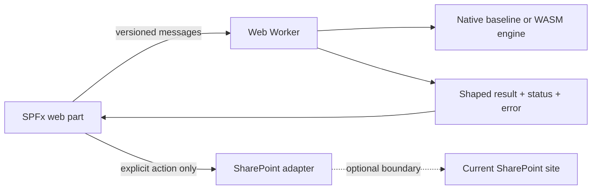

# SPFx + WebAssembly samples

## Use WebAssembly in SPFx when it earns its complexity

WebAssembly (WASM) is a compact binary instruction format and runtime target for browser code compiled from languages such as C/C++ or Rust. In SPFx it can make a specialized local engine practical, but it adds assets, loading, worker, CSP, memory, licensing, and support costs. WASM is not a privacy boundary, authorization layer, speed guarantee, or replacement for SharePoint and Graph controls.

This repository is an evidence-driven reference set: small, self-contained SPFx samples with explicit baselines, worker contracts, limits, claims, and measured-result boundaries. It is not a production certification, tenant compatibility matrix, browser support promise, benchmark leaderboard, or collection of server-side SharePoint solutions.

The worker is the default boundary for expensive or stateful engines. TypeScript owns UI, accessibility, validation, cancellation intent, and host integration; the worker owns the engine and returns a small typed result. Uploads are explicit and metadata declares whether they exist.

## Samples

<!-- GENERATED:SAMPLE-MATRIX:START -->
| Sample | Purpose | WASM path | Baseline | SharePoint writes | Maturity |
|---|---|---|---|---|---|
| [WASM image upload](samples/wasm-image-upload/) | Optimize selected images locally and upload only after explicit user action. | @jsquash/jpeg 1.6.0 | Browser-native image worker | Yes | L2 |
| [Local data plane](samples/wasm-local-data-plane/) | Experiment with a worker-owned SQLite-WASM local store and explicit sync contracts. | @sqlite.org/sqlite-wasm 3.53.4-build1 | Native in-memory adapter | No | L2 |
| [DuckDB-WASM analytics](samples/wasm-duckdb-analytics/) | Compare a native TypeScript aggregation with a worker-owned DuckDB-WASM aggregation. | @duckdb/duckdb-wasm 1.32.0 | Native TypeScript aggregation over the same fixture | No | L2 |
| [Local duplicate detector](samples/wasm-duplicate-detector/) | Group selected files with equal SHA-256 content locally. | No WASM | Browser Web Crypto SHA-256 | No | L2 |
| [Local OCR](samples/wasm-local-ocr/) | Recognize one selected local image with packaged Tesseract.js assets in a worker. | Tesseract.js 7.0.0 / packaged LSTM core | No native OCR baseline; engine failure is surfaced | No | L2 |
| [Smart upload preparation](samples/wasm-smart-upload/) | Hash and deterministically chunk one selected file locally before an optional upload. | No WASM | Browser Web Crypto SHA-256 | Yes | L2 |
| [SQLite list cache](samples/wasm-sqlite-cache/) | Demonstrate a worker-owned SQLite-WASM cache with local CRUD and simulated sync states. | @sqlite.org/sqlite-wasm 3.53.4-build1 | Sample-local memory store | No | L2 |
| [Local QR and barcode scanner](samples/wasm-qr-scanner/) | Scan selected still images with native BarcodeDetector and a visible packaged ZBar fallback. | @undecaf/zbar-wasm 0.11.0 | Browser BarcodeDetector when available and successful | No | L2 |
| [Local PDF inspector](samples/wasm-pdf-inspector/) | Inspect metadata and preview a selected local PDF with packaged PDFium WASM. | @hyzyla/pdfium 2.1.13 | No alternate PDF engine; failure is surfaced | No | L2 |
<!-- GENERATED:SAMPLE-MATRIX:END -->

Metadata is the source for this matrix. Run `node scripts/generate-readme.mjs` after changing a sample’s `sample.yml`; coherence fails if the generated section is stale.

Nine samples are included; the generated matrix above is their inventory. Validation status, deployment boundaries, and evidence level live with each sample’s metadata and documentation.

The first sample is a complete generated SPFx project at `samples/wasm-image-upload/`. Root commands delegate to that workspace and the root lockfile keeps installation reproducible.

## Roadmap

Future investigations, not current samples: a large-list local data plane; Graph materialization; a federated data plane; a local search index; and an optional Rust business-rules engine. Each needs a contract, native baseline, threat model, controlled evidence, and a clear SharePoint/Graph boundary before implementation.

Read the focused guidance: [what WASM means in SPFx](docs/WHAT-IS-WASM-IN-SPFX.md), [when to use it](docs/WHEN-TO-USE-WASM.md), [patterns](docs/PATTERNS.md), [cost model](docs/WASM-COST-MODEL.md), [technical security](docs/SECURITY.md), [benchmarking](docs/BENCHMARKING.md), [browser support](docs/BROWSER-SUPPORT.md), and [licensing](docs/LICENSING.md). Vulnerability reporting remains in the root [SECURITY.md](SECURITY.md).

## Contributing and project policies

See [AGENTS.md](AGENTS.md), [CONTRIBUTING.md](CONTRIBUTING.md), [SECURITY.md](SECURITY.md), [CODE_OF_CONDUCT.md](CODE_OF_CONDUCT.md), and [LICENSE](LICENSE). Repository invariants include validating worker RPC envelopes before dispatch, validating sync records before applying a page or advancing its cursor, using collision-resistant namespace filenames, suppressing cancelled preparation results, and awaiting cache storage initialization before status reads.

## Evidence boundary

WASM is an implementation option, not a performance guarantee. Browser-native image APIs already provide a local resize and encode pipeline, while a WASM codec adds binary assets, loading, CSP, and worker packaging concerns. The image sample reports the actual engine, measured duration, bytes, and warnings and has a native fallback.

No performance numbers are claimed in this repository. Values shown by the web part come from the files and browser run in front of the user.

## Current boundary

The sample includes local worker processing, an optional lazy WASM JPEG path, and an explicit SharePoint REST upload to the current site’s Site Assets library. The Heft customization emits `.wasm` as a same-origin client-side asset and leaves `asyncWebAssembly` disabled. Tenant CSP, worker loading, and upload validation remain pending.
